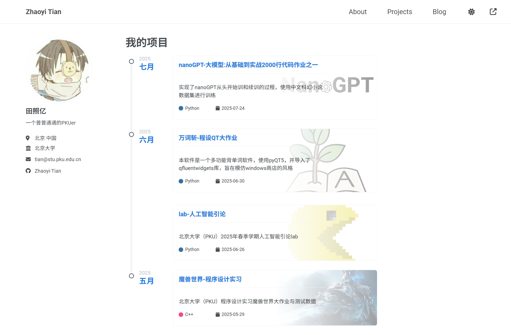

import { Aside } from 'astro-pure/user'

import { Steps } from 'astro-pure/user'

import { LinkPreview } from 'astro-pure/advanced'

## 前言

假期较长，闲暇时间较多，于是想着捣鼓一个个人主页出来。前后耗时约一个月，高强度使用AI，才将其改成了我比较满意的样子。

一共做了两个版本，部署在GitHub上的[学术主页](https://zhaoyi-tian.github.io/)和部署在Vercel上的Astro风格的[个人博客](https://www.zhaoyi-tian.cn/)，供大家参考。

申明：本人非xk大佬，不会写前端代码，大多数工作由AI完成。

此攻略算是经验分享帖，面向零基础小白，为搭建个人网站节省时间。

以下工具和技能对于你搭建自己的个人主页非常有帮助，但很多都是可以现学或问AI的：

- 基本的GitHub技能
- 基本的Git技能（在本地搭建并修改网页非常有用）
- AI使用技能，小白最好用能够自动帮你修改代码的AI，下述是我最近用的非常多的：
  - VS Code的Copilot，最好能先去GitHub上蹭一个学生优惠包
  - Claude Code。非常有用，但需要翻墙，这里提供两个国内可访问的链接
    - [any Router](https://anyrouter.top/register?aff=5iOh)，纯公益网站，每天签到可以获得25$额度，邀请一个人可有50$额度。但最近可能是人逐渐多起来了，使用体验极差，一直报错
    - [New API](https://instcopilot-api.com/register?aff=1Fqv)，收费，注册即有7$额度，邀请一个人会有2$额度，但好在稳定，使用体验非常好。（其实额度也花得比较慢）
- Markdown的写法，推荐用Typora，这款工具无需手动排版即可呈现美观效果，学会后非常实用。

## 学术主页&Github Pages

### 基本的网页搭建

故事的开端源自一则树洞#7489431

> #7488958 
> 大家好，这是一份面向小白的 GitHub Pages 个人网站搭建指南。本指南将尽量避免复杂的专业术语，并提供两种主流的搭建方法，你可以根据自己的情况选择。
>
> 申明：dz本人并非xk大佬，所以仅会最简单的配置，所以这篇指南比较适合新手来练练。毕竟拥有个人网站是一个很酷的事😎 另外，可能需要你有一定（极少量）的GitHub基础。
>
> 指南详见：
> https://classicalqy.github.io/website_building/
>
> 这里是指南概览：
>
> 指南核心目标：本指南旨在帮助初学者（小白）利用 GitHub Pages 免费搭建属于自己的个人网站。文章语言通俗易懂，并提供了三种不同的方法以适应不同需求的用户。
>
> 搭建准备与关键第一步
> - 准备工作：搭建前需准备好三样东西：科学上网工具、一个 GitHub 账号以及一台电脑。
> - 创建核心仓库：最关键的一步是创建一个特殊命名的公开（Public）仓库。仓库名必须严格遵循 你的用户名.github.io 的格式，这是 GitHub Pages 识别并生成个人主页网站的基础。
>
> 三种网站内容添加方法：指南提供了三种由简到繁的网站搭建方式
> - 方法 A：手动创建网页
> 简介：最基础的方法，直接在仓库中创建一个 index.html 文件并写入简单的 HTML 代码。
> 优点：能快速看到成果，为后续深入学习前端知识（HTML/CSS）打下基础。
> 适合人群：希望从零开始，未来想深入学习、实现高度个性化网站的学习者。
>
> - 方法 B：【推荐】使用官方主题模板
> 简介：通过 GitHub 仓库的 Settings -> Pages -> Theme Chooser 功能，选择一个官方预设主题。
> 优点：无需编写复杂代码，只需通过修改 _config.yml 文件（网站配置）和 README.md 文件（主页内容）即可快速生成一个美观的博客或展示网站。内容写作使用简单的 Markdown 语法。
> 适合人群：想快速拥有一个漂亮网站用于内容分享，但不想深入研究技术的用户。
>
> 方法 C：【最高效】Fork 成品模板
> 简介：在 GitHub 上找到一个设计精良的第三方网站模板项目，将其完整地“Fork”（复制）到自己的账号下。
> 关键操作：Fork 后，必须将这个新仓库的名称重命名为 你的用户名.github.io 来激活主页服务。
> 后续步骤：主要工作是修改模板的核心配置文件 _config.yml，将里面的标题、作者、描述、社交链接等信息替换为自己的。
> 优点：能以最快速度获得一个功能强大、设计精美的成品网站。
> 适合人群：几乎所有人，特别是希望高效获得高质量个人网站的用户。
>
> 常见问题与后续学习
> 问题排查 (FAQ)：指南解答了常见的 “404 Not Found” 错误（通常由仓库名错误、部署延迟等原因导致），并简要说明了如何发布新文章和绑定自定义域名。
> 进阶资源：最后，文章为希望深入学习的用户提供了非常丰富的学习资源，包括 GitHub 和 Jekyll 的官方文档、Markdown 语法教程、HTML/CSS 和 Git 的入门指南，以及更多寻找优秀网站模板的途径。
>
> 总而言之，这是一篇从零开始、步骤清晰、考虑周全的 GitHub Pages 建站教程。

### 后续网页的修改

当然，作为小白的我选择了第三种方式并fork了一个[学术主页模板](https://github.com/academicpages/academicpages.github.io)，但不是很满意，于是想要对其进行修改，譬如：

- 在目前还没有科研的情况下删去一些没用的页面，如talk、public。
- 新增一个projects页面来放一些自己课上做过的项目，并想通过月份分组，再用时间轴串起来。
- 对于blog和project的卡片，我希望它能够有渐变的背景和类GitHub的样式。

最终成果如下：

不讨论具体实现细节，只总结经验：

1. 在本地部署网站并实时预览自己的修改是非常有用的。（不知道为什么，该学术主页的Docker部署方式会报错，我最终是使用`bundle exec jekyll serve -l -H localhost`这个命令才在本地搭建成功的，具体可见你选择的主页的README文件）
2. 用和AI对话的方式来改页面和debug效率太低，强烈建议使用VS Code IDE并用Agent类型的AI，我用的AI可见前言。
3. 修改页面时，如果涉及到某种样式（譬如卡片由白色向图片渐变的样式），不要试图向AI用语言描述，这大概率效果不好。我是看到[某位学长网站](https://www.lyt0112.com/)的卡片后想要模仿，就直接F12查看源码，复制元素和CSS，丢给AI，于是完美复现。
4. Debug时直接把报错丢给Agent AI，效果很好（有一些Jekyll插件在本地能运行但在GitHub Pages上运行不了，于是会报错，网页也会一直显示之前的版本不更新，这个时候需要去GitHub官网上复制报错信息）
5. 使用Git进行版本控制可以有效防止AI对代码进行乱改。

## Astro风格个人博客&Vercel

<Aside type='caution' title='You should know it!'>Vercel托管的个人主页会被墙，所以需要自己去买域名并通过CloudFlare进行代理</Aside>

### 基本的网页搭建

我之前一直对着[一位学长的主页](https://www.lyt0112.com/)修改，结果突然发现其有[相应的模板](https://github.com/cworld1/astro-theme-pure)，看着我改了那么久的学术主页，再看看这个精美的模板，我感到有些失落。在纠结一阵后，最终决定在保留原先主页的同时再搭一个Astro风格的个人博客，成品如下：

[Astro](https://github.com/cworld1/astro-theme-pure)模板原生支持Vercel，导入非常方便，此处为其[文档](https://astro-pure.js.org/docs)

简化部署流程如下：

<Steps>
1. 在GitHub上fork [Astro](https://github.com/cworld1/astro-theme-pure)
2. 用GitHub账号登录Vercel  
3. 然后按照流程导入库即可，基本不需要额外操作
</Steps>

Vercel会监听GitHub库的变化，也就是说你通过Git提交到GitHub上之后，和GitHub Pages一样，Vercel的网页也会自动再次部署。

### 后续网页的修改

基本的通过AI修改的经验和学术主页一样，我甚至直接让AI把我学术主页上的内容同步到个人博客中。

### 域名&CloudFlare代理

这个博客写得很清楚

<LinkPreview href='https://blog.csdn.net/qq_62352333/article/details/134583242' />

现在CloudFlare的主页有点变化，和博客中描述的略有不同，但后续流程是一样的。

在这个页面输入购买的域名即可。代理生效后可能需要一段时间才能稳定运行。

### Waline配置

评论系统的配置，详见[快速上手 | Waline](https://waline.js.org/guide/get-started/)

注意，配置评论系统不是修改你原来Astro库的环境变量，而是要新建一个Waline的库，并修改其环境变量，[快速链接](https://vercel.com/new/clone?repository-url=https%3A%2F%2Fgithub.com%2Fwalinejs%2Fwaline%2Ftree%2Fmain%2Fexample)

然后将Astro库的src/site.config.ts中Waline的server配置项更新为你评论系统库的网址即可。

## 其它

阿里云学生每年有一张300块钱的券，[链接在此](https://university.aliyun.com/action/promotion-activity?clubTaskBiz=subTask..12036023..10236..&userCode=lsi8e6wt)，但使用有较多限制，不能用来购买域名等，但似乎可以用来购买云主机，有兴趣可以尝试一下。

## 致谢
在个人主页搭建过程中，得到了两位学长的重要启发，在此特别致谢：

Yutong Liang（https://www.lyt0112.com/）

Arthals（https://arthals.ink/）