简单做的一个毛利华社会心理学关键概念整理，一部分来自《社会心理学》（戴维 •迈尔斯  第十一版），部分概念标明了页数，另一部分来自ai。

背诵着重对概念的理解并且每个概念记1到2个例子，考试时会让你举例

考试时最后一题会给你一段文字，让你找里面的社会心理学概念并做阐释，然后根据社会心理学范式对一个概念提出假设，设计实验（我写得一坨，如何写才能得到高分需要各位注意，或许可以直接问问毛老师？）。

整理时难免有错误请多多谅解。

祝各位都能取得好成绩。

## **LECTURE_01&02_INTRO & Practical Methods** 

##### 社会心理学的重要问题和重要观点 p4,5;p6:3点

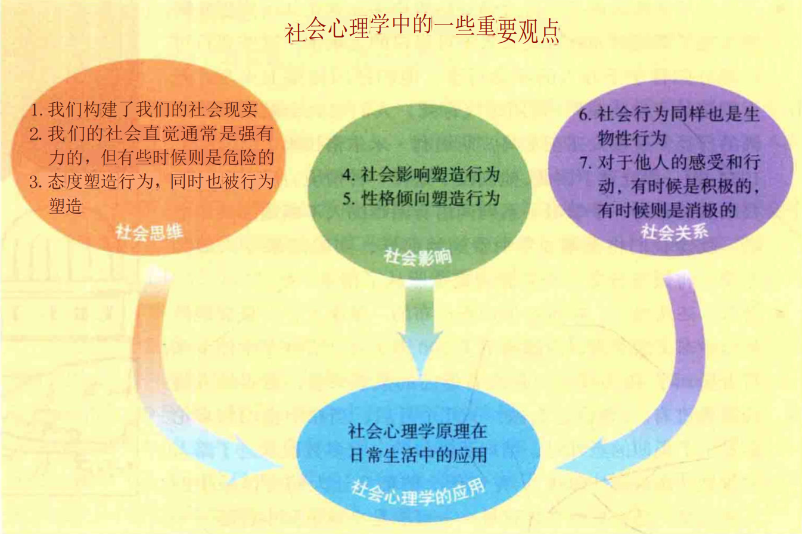

##### 科学研究过程 p17-29,29页有总结

- 理论：评判好的标准：1.有效概括大量观察结果 2.能做出清晰的预测
- 研究：相关研究，实验研究
- 相关不等于因果（自尊与学业成绩），高级相关研究可揭示因果（时序相关，剔除混淆变量）
- 评估调查的偏差来自：
  - 不具代表性的样本
  - 问题的顺序
  - 答案的选项
  - 问题的措辞
  - 框定（提前给出默认选项以影响决定，愿不愿意进行器官捐献，愿不愿意进行退休储蓄）

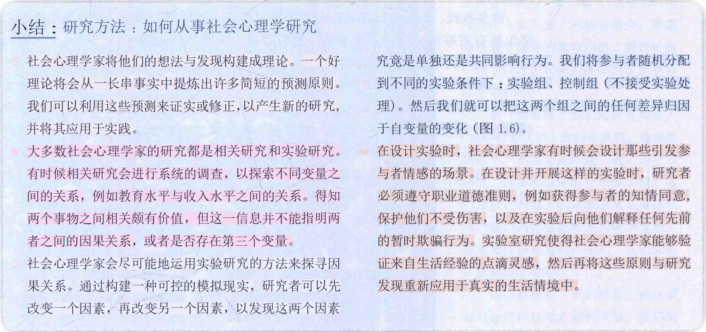

##### 研究方法类型，优缺点 p29

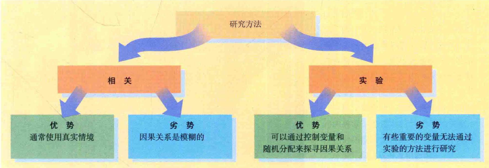

## **LECTURE_03_Self Awareness & Self Perception** 

##### 自我概念 p37

- 我是__的答案组合起来，自我图式（对自己的认识）+可能自我（对自己可能变成什么样子的认识）
- 自我图式：自我概念的构成要素+定义自我的特殊信念
- 社会经验对自我概念的影响
  - 我们扮演的角色
  - 我们形成的社会同一性 
  - 我们和别人的比较 
  - 我们的成功与失败
  - 其他人如何评价
  - 我们周围的文化

##### 自我参照效应 p37

- 当信息与个体自身相关时（即被“自我参照”地加工），该信息更容易被记住（编码得更深、更牢），并且在之后回忆时更准确、更迅速。简单来说，就是**与自己有关的事情，记得最清楚**
- 与自我图式相关
- 例子：
  - 朋友的生日与你接近就更容易记住

##### 社会比较 p38

- 将自己与他人比较，并思考为何不同

##### 自尊 p50

- 对自我的全面评价

- 动机：

  - 理论一：如同油料表，指示对我们生存和发展有导向意义的人际关系（社会拒绝降低自尊但增强我们被渴望接受的意愿。

  - 理论二：**恐惧管理理论**：个体必须找到克服死亡恐惧的办法：当人意识到死亡时 -> 产生存在性焦虑/死亡恐惧 -> 通过**认同并捍卫某种文化世界观** + **追求和维持高自尊**来缓解这种恐惧。但无法解释有人无法意识到存在的真正价值和“你因为是你而特别”这种完全无条件的自尊。

    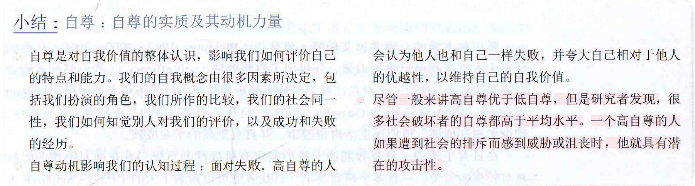

##### 自我效能，习得性无助，控制点 p56-59

- 自我效能：感到有能力完成某种任务
  - 相信有能力做一些事--自我效能感
  - 由衷地喜欢自己--自尊
- 习得性无助
  - 个体在经历重复的失败或负面事件后，逐渐形成一种 **“无论做什么都无法改变结果”** 的消极心理状态，最终导致放弃努力、被动接受命运的认知和行为模式。（“没有控制感”）
  - 例子：被关入笼中而无法躲避电击的狗，抑郁或压抑的人
  - 但同样我们可以通过训练自己的个人控制来获益
  - 实验 个人控制的重要性 p58:
    - 疗养院，三周，一组正常照料，一组促进个人控制，提供更多选择的机会
  - 过多选择会导致幸福感减弱
- 控制点
  - 个体对于影响自己生活的事件的原因归属方式
  - 人类究竟是命运的主宰者还是环境的牺牲品
  - 内部控制点： 个体倾向于相信事件的结果（无论是成功还是失败）主要取决于自身的内部因素。
  - 外部控制点：个体倾向于相信事件的结果主要取决于自身无法控制的外部力量。
  - 大学游泳队中与悲观的人相比，有乐观解释风格的人可能表现地更好

- 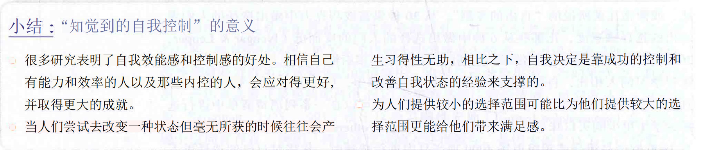

##### 自利偏差：焦点效应(p34)，自我服务归因偏差(p61)，高于平均(p62)，盲目乐观(p64)，虚假普遍性和虚假独特性 (p66)

- 焦点效应：人类把自己看作一切的中心，并且直觉地高估别人对我们的关注程度
  - 认为别人注意到自己衣服的比例大于别人实际注意到的
  - 透明度错觉：表现比自己意识到的不透明
  - 高估社交失误和公众心理疏忽
- 自我服务归因偏差：将好的结果归因于自己，将不好的结果归因于其它
  - 导致婚姻不和，把婚姻破裂·责任归于对方
  - “偏见盲点”：认为自己避免了自我服务归因偏差，但别人没有，更易导致发怒
- 高于平均：
  - 大多数人认为自己高于平均水平
  - 婚姻中普遍存在，做家务，做饭等等认为自己做的比另一个多
  - 因为自我服务偏差：
    - 可能原因（补充）：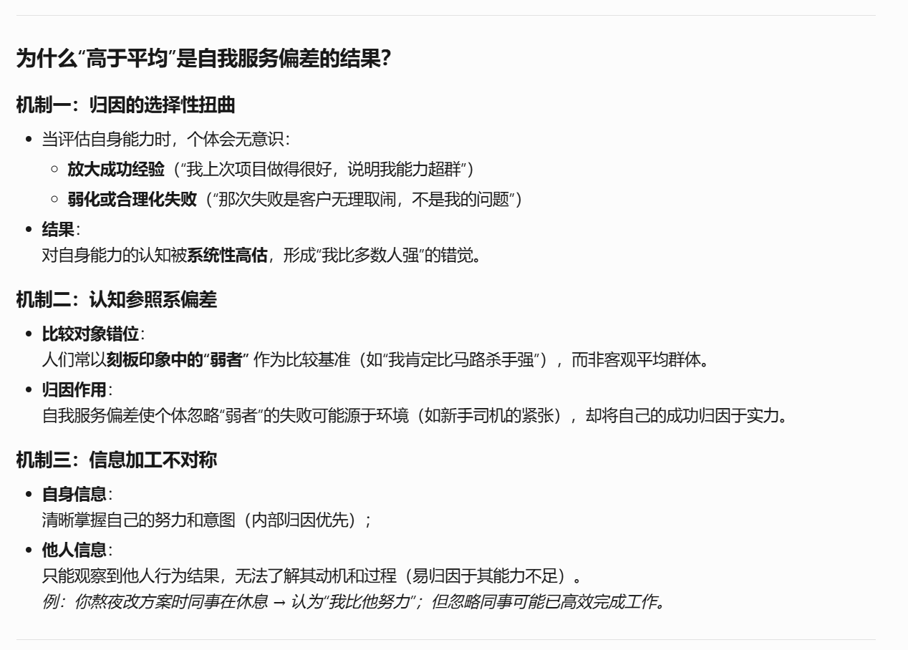
- 盲目乐观：
  - 乐天派：“天啊，又一个早晨来了”，对自己命运乐观，对他人命运相对悲观
  - 可增强自我效能感
  - 防御悲观主义
- 虚假普遍性和虚假独特性：
  - **普遍性**：高估他人会像我们一样思考的程度（常见于弱点和观点）；**独特性：**低估他人会像我们一样思考的程度（常见于能力和品德）
- 自利偏差的原因：
  - **认知捷径**
    大脑天然倾向于简化信息加工，夸大自身作用比客观分析更省力。（将自己与他人相比，要求我们去注意，评价，回忆自己与他人的行为，就增加出错的可能）
  - **多种动机**
    - 自尊维护，将成功归因于自身能力（提升自我价值感），将失败归因于外部因素（避免否定自我）。
    - 寻求自我认识，渴望评定自己的能力，了解自身真实能力的愿望
    - 寻求自我证实，渴望验证自我概念，维持一个稳定、一致的自我概念的愿望
    - 寻求自我确认，希望提升自我形象，在他人面前建立并维持一个积极的公众形象
  - **控制感幻觉**
    高估个人能力可增强对环境的掌控感（“我能主导结果”），减少焦虑。
  - **进化适应性**
    在生存竞争中，自信者更易争取资源（即使略有夸大），该倾向被自然选择保留
- 群体服务偏差：认为自己群体是最棒的

##### 自我展示，自我监控，自我妨碍 (p71)

- 自我妨碍：人们通过设置障碍来阻挠自己获得成功：
  - 减少对重要的个人赛事的准备 
  - 给对手提供一些有利条件
  - 在任务刚开始时不好好干，这样就不至于对自己产生过高的期望
  -  在那些关系到自我形象的困难任务中并不尽全力
- 自我展示：我们想要向外在的观众（别人）和内在的观众（自己）展示一种受赞许的形象
  - 例子：社会交往，社交网络，精装的朋友圈
- 自我监控：不断监控自己的行为，注意他人的反应，调整自己的社会行为以获得社会赞许。

## **LECTURE_04_Social Cognition** 

##### 社会认知 p78

对信息的知觉和解释

- 启动：唤醒或激活记忆中的某种特定连接

- 政治知觉：一个简单刺激引起两个人不同的反应，如两边都认为裁判偏向另一方
- 我们对他人：先入之见
- 他人对我们的知觉：自发性特质转移

##### 图式 p86 

- 心理概念或模板，自发引导我们的知觉和解释

##### 信念固着 p82：

- 个体一旦形成某种信念，即便面对相反的证据或逻辑驳斥，仍倾向于坚持原有信念而难以改变的心理现象（即使支持他的证据被否定）
- 实验：每一个实验给被试一种信念（宣称某个结论是正确的，或者向人们出示一些证据）（一般人相反），然后要求被试解释为什么结论正确，最后告诉被试真相，彻底否定最初的结论，但只有25%被试接受

##### 刻板印象 ：

- 人们对某个群体或事物形成的一种概括而固定的看法，通常基于有限的信息或经验，忽视群体内个体差异。

##### 自上而下加工、自下而上加工 ：

- **自下而上加工：**
  - **驱动方向：** 从感觉器官（眼睛、耳朵、皮肤等）接收到的原始感官数据开始，逐级向上传递处理。由感官**输入驱动**。
  
  - **信息来源：** 完全依赖于**外部刺激的物理属性**（光波、声波、压力、味道分子等）。
  
  - **特点：** 客观性高、数据驱动性、相对被动。大脑将这些原始“特征”组合起来形成初步感知。
  
  - **比喻：** 像搭积木，从最基础的形状（线条、边缘、音调）开始组合成更大的结构（物体轮廓、单词发音）。
  
- **自上而下加工：**

  - **驱动方向：** 从大脑中的**高级认知活动**（如记忆、经验、知识、期望、动机、情境、任务目标）开始，向下指导或影响对感觉信息的解释和处理。由**已有知识预期驱动**。

  - **信息来源：** 主要依赖于**个体内部存储的信息和认知状态**。

  - **特点：** 主观性强、概念驱动性、主动性、具有解释性（甚至可能造成错觉）。大脑利用已有知识“预测”或“填充”感知。

  - **比喻：** 像看图纸造房子，图纸（已有知识/预期）指导工人如何组装原材料（感觉信息）。

- 例子：

  - 情境：你在路上走，瞥见一块模糊的路牌。
    - 牌子有点旧，字体磨损，看起来像“S_OP HERE”或 “St_p H_re”。
  - 自下而上加工发生：
    - 你的眼睛接收到**感觉信息**：特定位置、明暗对比的像素点、线条和曲线。
    - 初级视觉皮层处理：识别出基础的**视觉特征**（垂直/水平的线、弯曲线条、端点等）。
    - 更高视觉区域处理：组合特征识别出**简单的字母形状**，比如你识别出开头是“S”，接着有一个模糊的形状像“t”或“o”，然后是“P”或“H”，等等。
  - 自上而下加工介入：
    - **上下文知识：** 你身处一条繁忙的商业街上，两边都是商店。你的**知识**告诉你，路牌很可能是商店的标识或交通指示。
    - **语义知识/词汇知识：** 你**知道**常见的路牌内容可能有“STOP HERE”（停车点）、“SHOP HERE”（此处购物）。
    - **期望：** 你希望找到停车点或商店，或者附近刚好有个著名的购物点叫“Stop & Shop”。
    - **决策：** 你的大脑（高级认知）根据这些**知识、预期和情境，强烈地“推动”你将模糊的形状解读为“STOP HERE”或“SHOP HERE”**，即使原始感官数据并不完全清晰。如果没有这些预期，你可能会解读出完全不同的字母组合（比如“S_OP H_re” 可能是“Slop Here”，但不符合常识）。

##### 行为确认p110-113：

- 人们对他人持有的先入为主的期望（无论正确与否），会在互动中无意识地引导他们采取某种行为，最终导致对方的行为符合其最初预期（?）
- 一旦形成错误的社会信念，就可能引发他人做出某些行为反应以支持这些信念，这种现象叫做行为确证 ( behavioral confirmation )。   
- 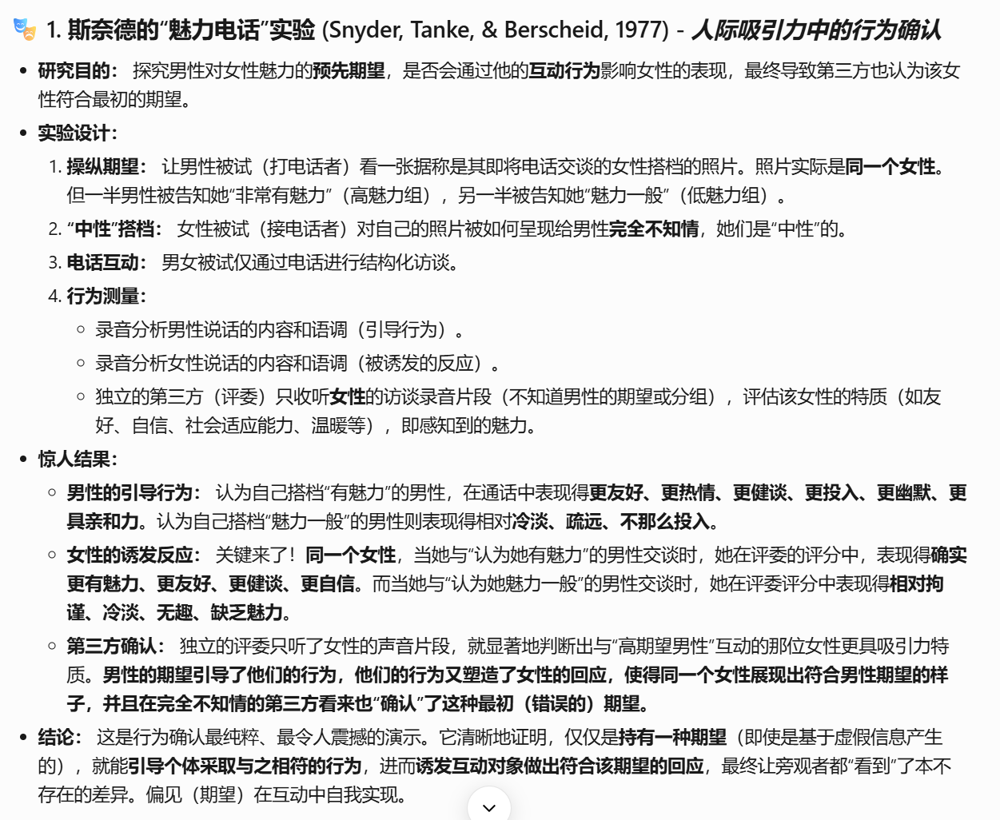
- 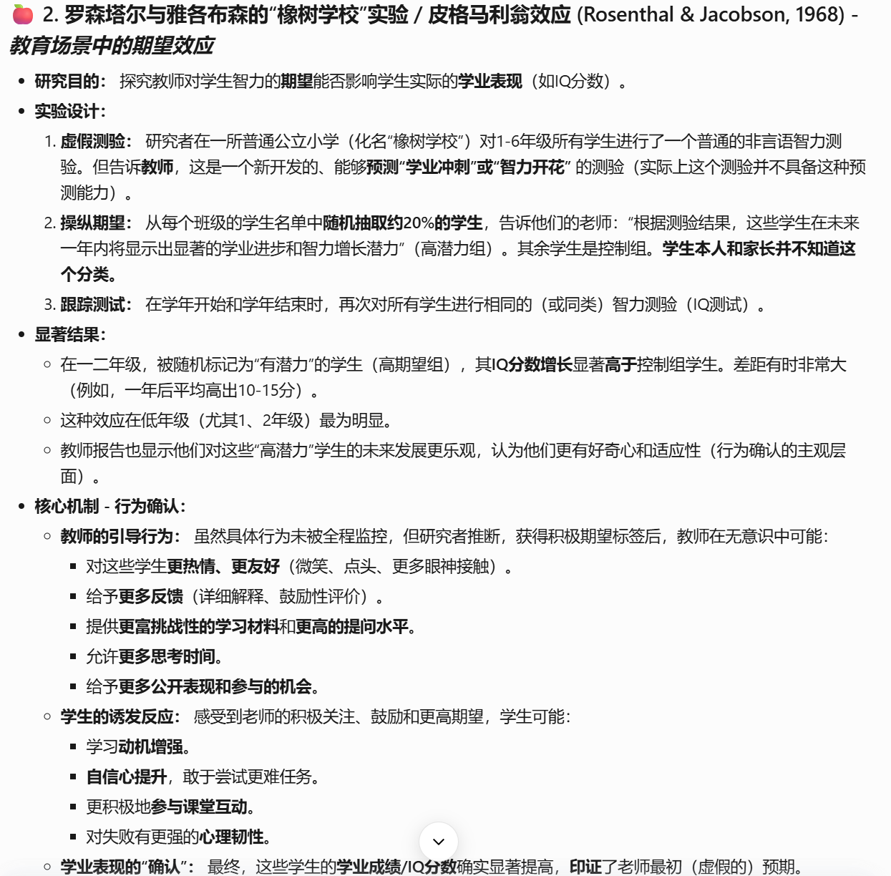
- 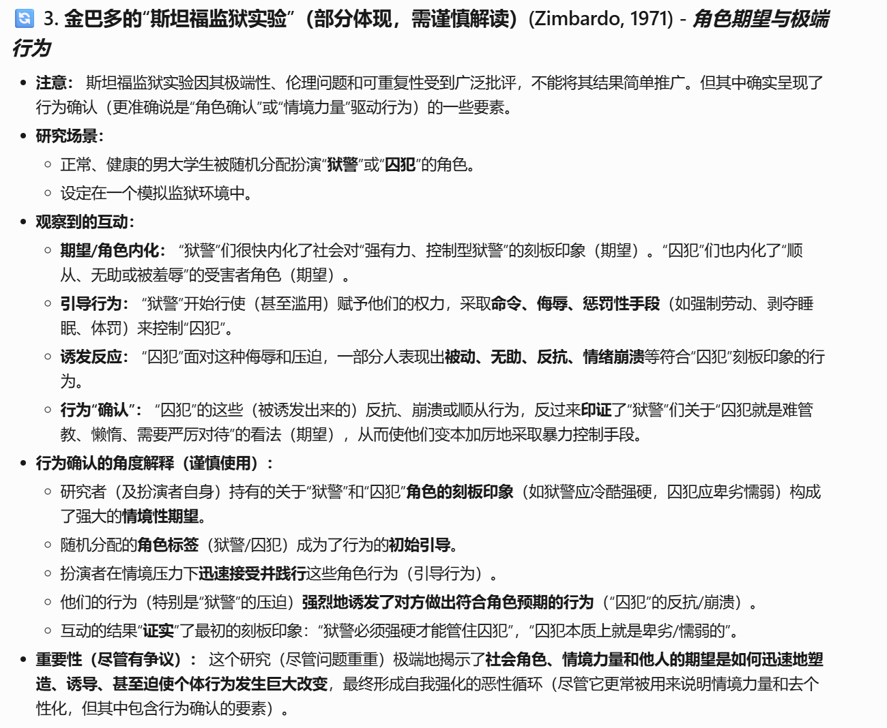

##### 归因理论p102

- 人们倾向于将行为原因归为两类
  - 内部归因（ dispositional attribution）：性格、能力、动机等个体特质；
  - 外部归因（ situational attribution）：环境压力、任务难度、运气等外部因素。
- 错误归因

##### 对应推论理论 p102

- 通过行为推断意图和目的，不寻常的行为能让我们更多地了解这个人

##### 凯利的归因理论（共变模式） p103

- 一致性 ：个体在这种情境下出现类似行为的一致性如何？
- 区别性 ：个体的这种行为是否具体对应于该特定情境？
- 共同反应 ：其他人在这种情境下出现类似行为的可能性如何？
- 当解释为什么埃德加用电脑的时候总是出问题时，大多数人参考的信息包括 ：一致性（埃德加经常都无法使其电脑正常工作吗？ ）， 区别性（埃德加是仅仅不能使用这台电脑还是其他的电脑也不能使用？ ）， 以及共同反应（其他人在用这个型号的电脑时也会出现问题吗？ ）。 当我们了解到埃德加在使用所有电脑都会遇到麻烦时，那么我们往往会将原因归结于埃德加, 而不是电脑本身的问题。  

##### 基本归因误差 p104

- 解释他人行为时低估环境造成的影响，高估个人的内在特质和态度所造成的影响
- 原因：
  - 行动者-观察者错误
  - 文化差异

##### 行动者-观察者错误 p106

- 视角和情境意识（我们从自己关注的地方寻找原因）：自己的行为会注重环境，而观察别人时会更注意到人

##### 基本归因错误的文化差异 p108

- 西方个人主义：更注重人
- 东方集体主义：更注重环境

## **LECTURE_05_Attitude and Behavior** 

##### 态度 p119

- 个体对人或事物的积极或消极的评价性反应，它通常根植于个体的信念，表现于个体的感受或者行为倾向中  

##### 基于认知/情感/行为的态度 p120

- 情感:“健身时感到愉悦”  
- 行为倾向:  “每周计划去 3 次健身房”  
- 认知: “健身能增强免疫力”

##### 内隐态度/ 外显态度

- | 类型     | 定义                     | 常用工具                                        |
  | -------- | ------------------------ | ----------------------------------------------- |
  | 外显态度 | 有意识、可自我报告的态度 | 李克特量表、语义差异，排序法                    |
  | 内隐态度 | 无意识、自动化的态度     | 内隐联想测验（IAT),测量面部肌肉对各种声明的反应 |

##### 内隐联想测验 p121

- 用反应时测量人们概念联想的速度，白人将黑人面孔与积极词汇联系起来是否更容易
- 得出:
  - 内隐偏见普遍存在
  - 内隐偏见存在个体差异
  - 人们通常意识不到自己的内隐偏见

##### 认知失调理论 p135

- 态度改变是因为我们想保持认知间的一致性
- 选择性接触与自己观点一致的信息
- 伊拉克战争
- 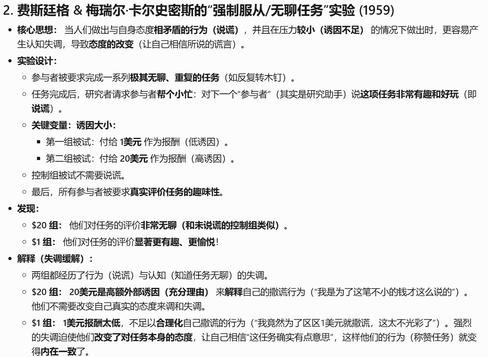

##### 决策后失调 p138

- **做出重要决定（尤其是困难的、涉及多个选项的决定）后**，个体普遍体验到的认知失调状态。就会高度评价自己的选择而贬低现在的选择以减少失调

##### 态度与行为不一致的影响因素 p125小结部分

-  如果把“其他因素的影响”最小化（比如环境什么的，观察通常的行为比单独一次的行为更准）
- 如果态度与预测的行为 ( 比如对投票的研究 ) 紧密相关
-  如果态度是强有力的 (以某一些事提醒我们牢记这点，或通过直接的经验意识到这点)。
- 在这些情况下，我们的所想所感与我们的所为会紧密相关。

##### 计划行为理论 p123

- 一个更好的预测行为的指标是，了解个体的行为意向和他们知觉到的自我效能感和控制感
- 态度+社会规范+控制感
- 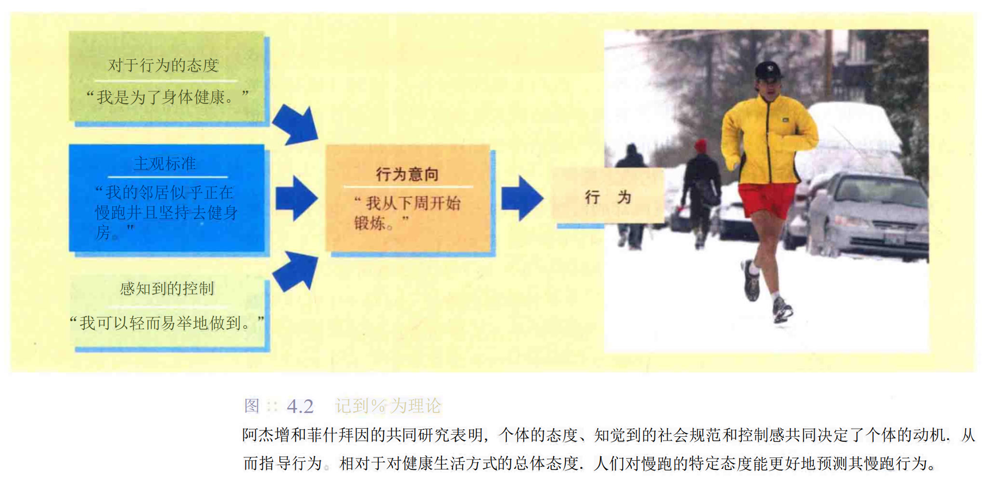

##### 学习理论 

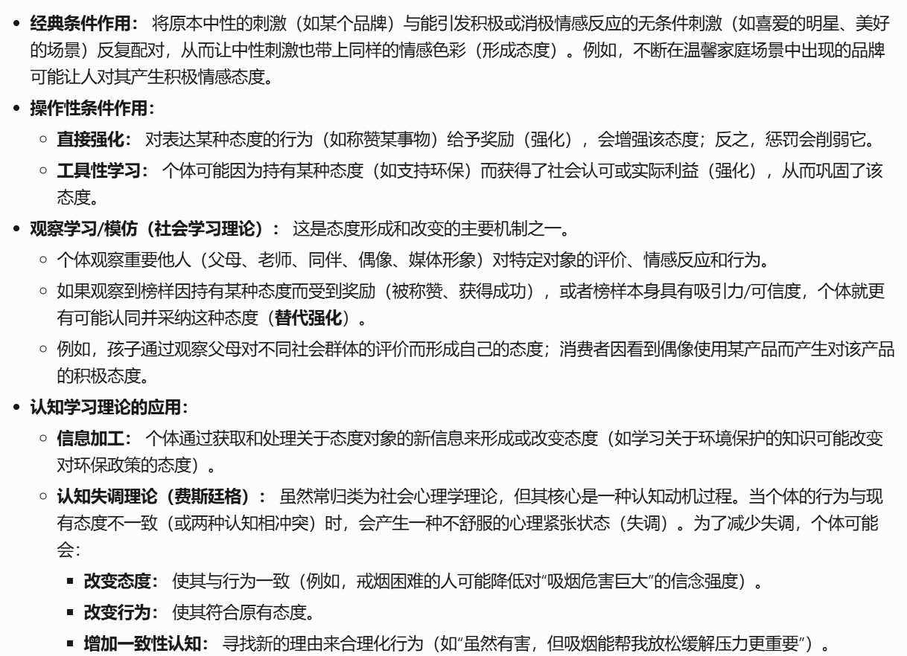

##### 认知一致性理论 p135

​	人类有一种基本的心理需求（动机），即追求认知（包括态度、信念、知觉、价值观等）之间的一致性或和谐（Harmony）。当认知之间出现不一致（失调、冲突、不平衡）时，就会产生一种不舒服的心理紧张状态，这种不适感会驱使人们主动采取措施来减少或消除这种不一致，恢复认知的协调状态。

##### 情绪影响态度：恐惧诉求理论 

- **恐惧诉求理论（Fear Appeal Theory）** 是社会心理学和传播学中，研究**如何运用恐惧情绪来改变人们态度和行为**的核心理论。它探讨的核心问题是：**当信息通过引发受众的恐惧感（如强调威胁的严重性和易感性）来试图说服时，在什么条件下最有效？什么时候反而会适得其反？**

- 其核心观点是：**单纯吓唬人（引发高恐惧）通常不足以有效改变态度或行为，甚至可能引起抗拒。真正关键在于，信息在引发恐惧的同时，必须让受众感知到所推荐应对行为的有效性和可行性（反应效能与自我效能），并且这种应对行为的收益（感知收益）大于其成本（感知障碍）**
- 例子：

##### 为什么行为会影响态度

- 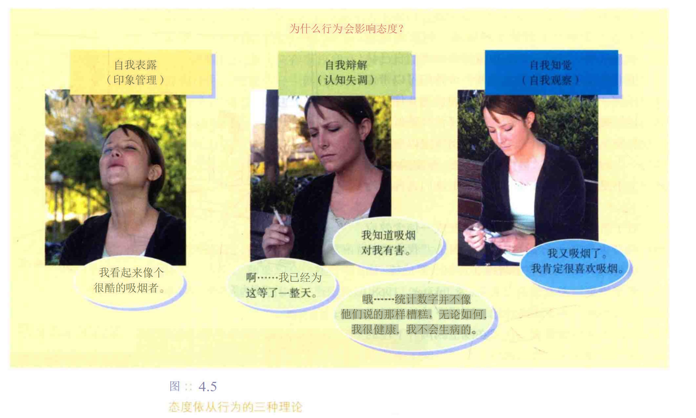

自我知觉理论（Self-Perception Theory）：**人们在理解自己的内在状态（如态度、情绪、偏好）时，并非直接“内省”获得，而是像一个外部观察者一样，通过观察自己过去和当前的行为以及行为发生时的情境，来推断自己持有什么样的态度或感受。**为认知失调的实验提供另一个解释：看起来自己的行为不那么真诚

自我表露理论解释了为什么从表面上看起来行为会影响态度 ,而另外两种理论则解释了行为确实影响态度的原因:

1. 认知失调理论假定我们为自己的行为辩护.以此来减少我们内部的不适;
2.  自我知觉理论则假定同观察和推断他人态度一样，我们会审视自己的行为并且做出合理的态度推断  

## **LECTURE_06_Judgement_and_Decision_Making** 

##### 框架效应 

- 相同的信息，仅仅因为表达方式（即“框架”）的不同，就会显著影响人们的选择和判断，甚至在逻辑上完全等价的两个选项之间也会产生偏好反转。
- 牛肉标签描述：75%瘦肉（正面框架） vs. 25%肥肉（负面框架）。**正向框架通常更受欢迎。**
- 防晒霜广告：“使用防晒霜，享受阳光无惧损伤（正面好处）” vs. “不使用防晒霜，皮肤老化加速、癌变风险大增（负面威胁）”。**强调负面后果常常在健康/预防行为上更有效（尤其结合恐惧诉求理论时）。**
- 器官捐献登记：**默认不捐献（Opt-in）** vs. **默认捐献（Opt-out）**。后者的同意率显著高于前者。**人们倾向于保持默认状态。**
- **投资决策：** “预期年化收益率8%（但可能亏损）” vs. “历史最大回撤达15%（但有较高回报潜力）”。前者更吸引风险厌恶者，后者可能吓走部分人。

##### 双系统理论：系统 1、系统 2 

- **人的认知和决策过程由两种不同的、相互作用的心理系统（或加工模式）驱动**：
  1. **系统1（System 1）：** 快速、自动、直觉化、非意识化、并行加工、基于经验和情感。（自动化加工）
  2. **系统2（System 2）：** 缓慢、受控、深思熟虑、意识化、序列化加工、基于规则和分析。（受控加工）
  3. 例子: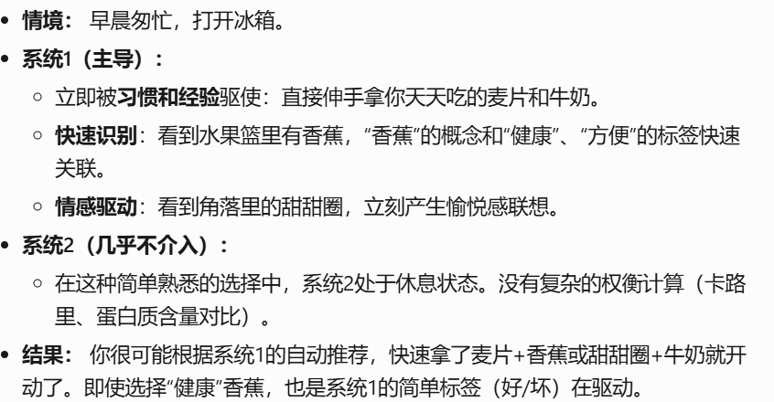

##### 启发式思维：可得性启发、代表性启发、锚定效应 p92 

- **可得性启发**：人们在判断某事件发生的**频率、概率或可能性**时，往往会**过度依赖记忆中能够轻易回想起相关事例或信息的容易程度（可得性）**，而非基于更客观的统计数据或概率。（911事件)
- **代表性启发**：人们倾向于**根据某事物或人是否与某个类别的原型（或刻板印象）相似**来判断它属于该类别的可能性，而常常忽略其他重要信息，尤其是基础概率信息（即该类别的整体发生率）和样本大小。
  - 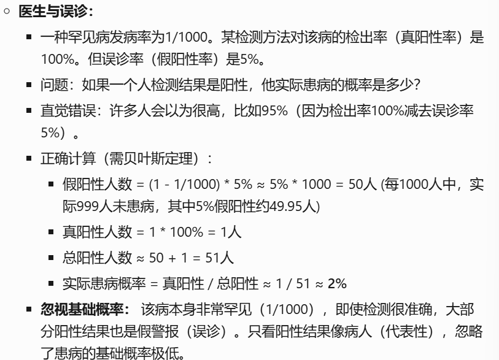
  - **工程师还是图书管理员？**
    - **描述：** 杰克对打探别人隐私毫无兴趣。他觉得慢悠悠地散步是最舒服的。他虽然性格内向，但对人友善。他温顺随和，喜欢秩序和规律的生活，做事情非常细致认真。
    - **问题：** 杰克更有可能是**工程师**还是**图书管理员**？
    - **错误判断（代表性启发）：** 很多人觉得描述很像典型的“图书管理员”形象（内向、细致、安静），因此认为杰克更有可能是图书管理员。
    - **忽视的基础概率：** 社会上的工程师数量**远多于**图书管理员（基础概率高得多）。即使描述与图书管理员的刻板印象更贴合，但考虑到工程师庞大的基数，一个具有这些特点的人更可能是工程师群体中的一个普通成员，而不是数量稀少的图书管理员群体中的一个成员。
    - **结论：** 代表性启发让人们忽略了工程师基数庞大这个事实，而只关注描述与刻板印象的匹配度。
- **锚定效应**：在做出估计或判断时，人们会过度依赖最先接收到的信息（“锚点”），即使这个信息是随机的、无关的或明显错误的，后续的判断也会围绕着这个初始锚点进行调整，并且调整往往是不充分的。“原价：¥999，现价：¥499” 

##### 禀赋效应 

- 人们对于自己已经拥有的物品，会赋予其比未拥有前或同等市场价值更高的主观价值。
- 市场营销:
  - **免费试用 & “免费加运费”：** 让用户“暂时拥有”产品（如试用、或只付运费获得一件小商品），利用禀赋效应增加其对物品的价值认同（一旦拿在手里就觉得值），从而刺激最终购买或后续交易。
  - **7天无理由退换：** 用户使用产品后可能会产生拥有感，即便有一点小问题也可能觉得“不值当换”或懒得退（放弃变得痛苦）。
  - **个性化定制：** 在产品定制过程中让用户投入精力（如刻名字、设计样式）使物品成为“他们自己的”，进而产生更强的禀赋效应（更珍视、更难放弃或退还）。

## **LECTURE_07_Pro & Anti Social Behavior** 

##### 攻击（敌意性攻击、工具性攻击） p350

- 敌意性攻击：由愤怒等情绪引起并以伤害为目的
- 工具性攻击：达到其它目的的一种手段

##### 攻击行为的理论 p351 

- 生物学影响，本能，神经系统，基因，生物化学因素（酒精，睾酮）等等

- 挫折-攻击理论

  - 挫折：当我们达到一个目标的动机非常强烈，我们预期得到满意的结果，却在行动过程中遭到阻碍，挫折导致攻击
  - 修正后的：挫折产生的是愤怒，即攻击的一种情绪准备状态。愤怒起源于某个有其他行为选择可能的人阻挠了我们实现目标  
  - 挫折还可能来自于相对剥夺：期望和现实的差距
  - 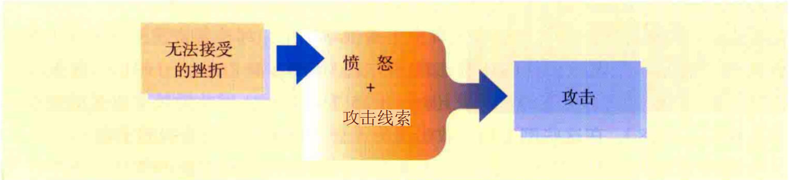

- 社会学习理论

  - 攻击会有回报，恐怖主义

  - 人们对攻击的学习不仅发生在亲身体验其后果时，通过观察别人，我们同样会习得攻击

  - 班杜拉的社会学习理论实验：

  - - 步骤一：分组与观看榜样行为
      - 将儿童随机分成三组：
        - **攻击组（Aggressive Model）：** 观看一个成年榜样进入游戏室，对波波玩偶（一个充气不倒翁娃娃，如小丑形象）进行一系列**身体和言语攻击**（如打、踢、扔、坐在玩偶身上、用锤子敲、喊叫“踢死它”、“揍它鼻子”等）。约持续10分钟。
        - **非攻击组（Non-Aggressive Model）：** 观看一个成年榜样在游戏室里安静地玩拼图或其他玩具，完全不理会波波玩偶约10分钟。
        - **控制组（No Model）：** 没有观看任何榜样，直接进入下一个环节。
      - 榜样分为男性和女性，以便研究性别影响。
    - 步骤二：制造挫折/唤醒
      - 所有儿童被带到另一个房间，里面有很多吸引人的玩具（如消防车模型、玩偶屋）。他们被允许玩一会儿，然后实验者进来宣布这些是“最好的玩具”，是留给其他孩子的，现在不能玩了。这是为了**激发所有儿童的挫败感和攻击冲动**。
    - 步骤三：观察模仿行为（关键环节）
      - 把儿童单独带进第三间游戏室（“潜在攻击性测试室”）。里面有各种玩具，包括：
        - **攻击性玩具：** 波波玩偶（重点）、木锤、飞镖、标枪等。
        - **非攻击性玩具：** 茶具、蜡笔、塑料动物、玩偶等。
      - 让儿童单独在房间里玩 **20分钟**。实验者通过**单向玻璃**（儿童看不见观察者）**秘密记录**儿童行为。
      - 记录内容极其详细：
        - **模仿的物理攻击行为**（打、踢、摔打玩偶等）
        - **模仿的言语攻击行为**（如喊榜样使用的攻击性词语）
        - **新颖的攻击行为**（非完全模仿，但属攻击性）
        - **非攻击行为**（安静玩耍等）

  - **惊人发现：**

    - **显著模仿：** **攻击组**的儿童表现出**明显更多**的对波波玩偶的**身体和言语攻击行为**，无论是模仿榜样的特定动作（用锤子敲），还是模仿榜样的攻击性话语。他们不仅模仿，有时还会创造性地发明新的攻击方式打玩偶（非模仿但属攻击）。

    - **抑制模仿（非消除学习）：** **非攻击组**的儿童对波波玩偶的攻击行为**显著低于**攻击组**甚至控制组**。这表明观察到平静、非攻击性榜样，会对儿童的行为产生**抑制作用**。

    - **性别模仿差异：** 儿童（尤其是男孩）倾向于更**多地模仿同性别榜样的行为**。

    - 行为表现差异（后续引入强化因素）：

       在后续实验中（1963年），班杜拉又增加了两个组：

      - **榜样受奖组：** 在儿童观看攻击性榜样行为后，看到榜样被另一人奖励（夸赞）。
      - **榜样受罚组：** 在儿童观看攻击性榜样行为后，看到榜样被另一人惩罚（训斥、打屁股）。
      - 发现：
        - 看到榜样受奖后，儿童在自由游戏时**表现出更多**攻击行为（替代性强化效应）。
        - 看到榜样受罚后，儿童在自由游戏时**表现出更少**攻击行为（替代性惩罚的抑制效应）。
        - **但是！** 当后来实验者告诉所有儿童，如果他们能模仿榜样之前的行为（攻击波波玩偶），就能得到奖励（如巧克力、贴纸）时，**榜样受罚组的儿童表现出的攻击行为知识/能力与榜样受奖组和控制组几乎一样多！** 这证明**学习已经发生**（认知层面记住了行为），替代惩罚只是**抑制了行为在不利结果预期下的表现**，并未抹除学习痕迹。学习是内在的认知过程。

- 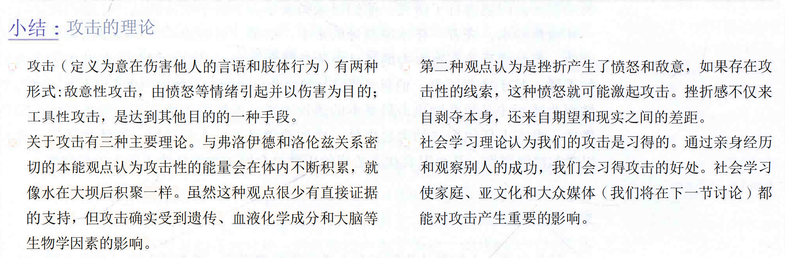

##### 影响攻击行为的因素	 p364 p379群体影响

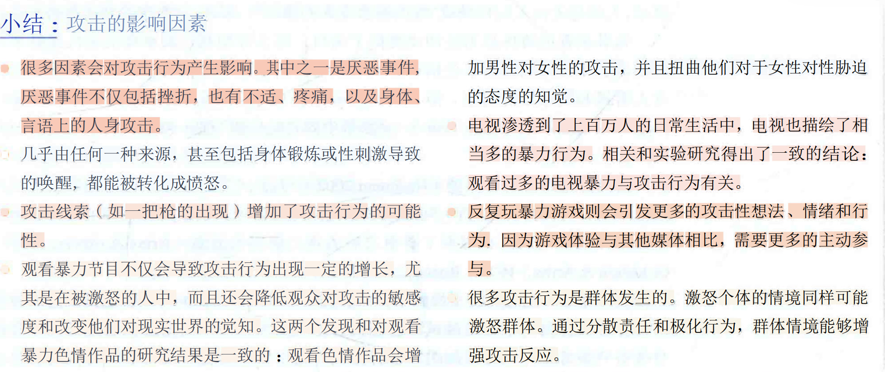

##### 如何减少攻击 p381

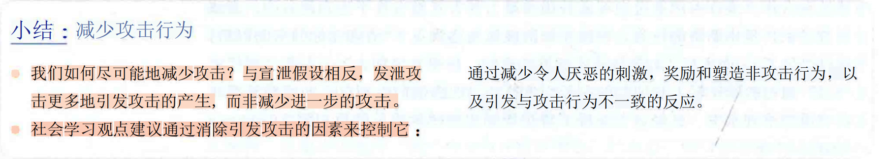

##### 亲社会行为（利他行为、助人行为） 

- 自愿做出的、旨在使他人或社会获益的行为

- `利他行为` ⊂ `助人行为` ⊂ `亲社会行为`

##### 亲社会行为的理论 

- **社会交换理论**把帮助行为看做和其他社会行为一样，是由对代价最小化和收益最大化的追求所驱动的。收益也可以是内部的。人们在做错事后，通常会更愿意为他人提供帮助。
  - 悲伤的人也倾向于做出帮助行为（关注他人的人中发生）。最后，存在着显著的好心情一好行为效应 ：快乐的人一般也是乐于助人的人。社会规范同样要求人们帮助他人。(但是容易陷入循环论证，我们必须把收益和成本独立于帮助行为之外，帮助行为得到赞许后帮助行为会增加)
- **互惠规范**促使我们帮助曾经帮助过自己的人。**社会责任规范**召唤我们帮助那些需要帮助的人，只要他们值得帮助，即便他们不能回报，我们也无所谓。处于危难中的女性，部分原因是她们看起来更需要帮助，因此通常会比男性接受到更多的帮助，特别是来自男性的帮助。（将危难归因于外界会激发同情，进而影响帮助行为）
- **进化心理学**假定，有两种形式的帮助行为 ：奉献于亲属和奉献于有互惠关系的人。然而，很多进化心理学家认为，自私的基因比自我牺牲的基因更有可能存活下来，因此，自私是人类的本性，社会必须教导人们去帮助他人
- 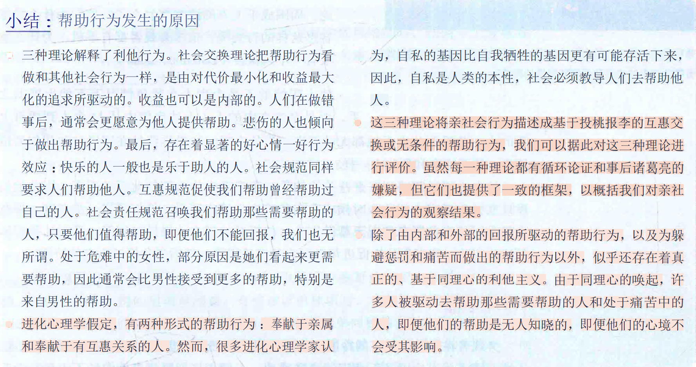

##### 助人三/四步决策 

- **四步模型 (非常常见)**

  1. **注意/觉察：** 认识到情况不对劲。
  2. **解释/判断责任：** 将情况判断为需要帮助，并**认识到自己负有或能够承担帮助责任**（合并了原五步的第2和3步的核心）。
  3. **选择帮助方式/评估能力：** 决定自己可以如何安全有效地进行干预（直接帮助、寻求专业帮助、动员他人等）。
  4. **行动：** 采取步骤进行干预。

  **三步模型**

  1. **注意：** 看到/听到可疑或不寻常的事情。
  2. **判断责任与能力：** 将此判断为需要干预的情况，并确认自己是有责任/能力采取行动的人之一（合并原五步的2、3、4步）。
  3. **行动：** 实施帮助行为。

亲社会行为产生的因素 

##### 助人者的特点和受助者的特点 p465

- 受助者的特征会强烈影响他人是否会提供帮助、如何帮助以及帮助的强度：
  1. **感知到的需求强度与合理性 (Perceived Need & Deservingness)：**
     - **显著性与紧急性：** 受助者表现出的需求越明显、越紧急（如晕倒、流血、剧烈哭泣），越容易吸引注意和获得帮助。
     - **归因与合理性：** 如果旁观者将受助者的困境归因为**不可控的**（如自然灾害受害者、疾病、意外事故）或**合理的**原因，更可能同情和帮助。若归因于**可控制的**（如懒惰导致贫穷、醉酒导致摔倒）、或者认为其“**不值得**”（如态度恶劣、道德低下），帮助意愿会大大降低（“应得性”感知）。
  2. **依赖性与能力 (Dependency & Competence)：**
     - **实际依赖度：** 受助者明显表现出无法独立解决问题、需要外部帮助的状态。
     - **感知能力：** 被感知为**缺乏应对能力**的人（如老人、小孩、残疾人、病人、陌生环境中的访客）更容易获得帮助。如果表现出一定的自我解决能力，帮助意愿可能降低。
  3. **吸引力与亲和力 (Attractiveness & Likability)：**
     - **外表与社会特征：** 通常，在外表上或社会特征上（如亲和、有礼貌）具有**吸引力**的受助者更容易获得帮助。这与积极的刻板印象和偏好有关。
     - **友好态度：** 表现出友好、真诚求助态度的受助者更容易得到积极回应。
  4. **相似性/群体身份 (Similarity & Group Membership)：**
     - **“内群体”效应：** 与助人者共享种族、性别、国籍、爱好、社会身份（如同事、校友）等特征的受助者更易得到帮助（与助人者特点中的相似性呼应）。
  5. **求助信号的明确性 (Clarity of Cues)：**
     - **明确表达：** 受助者明确发出求助信号（直接求助、眼神接触、明显痛苦表现）比模棱两可或被动等待更容易激发助人行为。模棱两可会增加情境不确定性，阻碍助人决策的第二步（解释为紧急事件）。
  6. **接受帮助的态度 (Attitude towards Receiving Help)：**
     - **威胁自主性：** 帮助行为有时会让受助者感到**自主性被削弱、自尊心受挫、产生亏欠感**。受助者对接受帮助的态度（是感激接受，还是抗拒被动）会影响互动质量和后续帮助的可能性。
     - **依赖风险：** 过度或长期的帮助可能导致受助者产生依赖心理，不利于其自身发展。成熟的受助者会平衡接受帮助与自力更生。

- 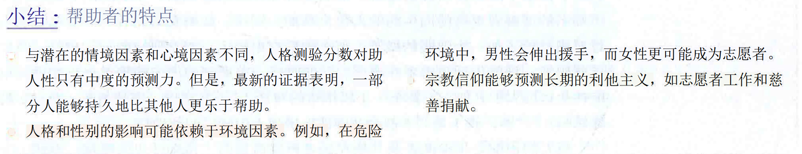

##### 如何增加帮助行为 p465-p472

- 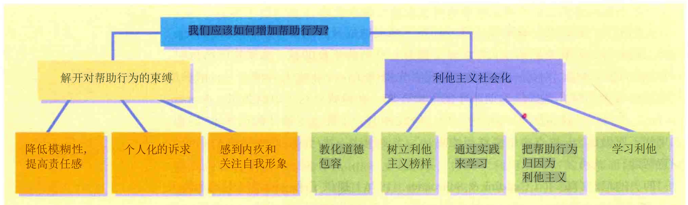
- 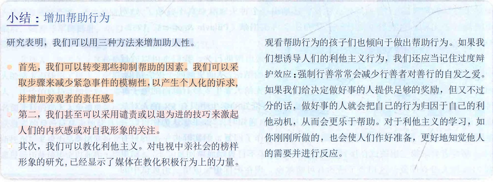

## **LECTURE_8_Persuasion & Prejudice** 

##### 说服的途径有哪些/说服的模型 

##### 中心途径说服（central route to persuasion）p225

- 受众具备高动机（如与自身利益高度相关）和高能力（如具备相关知识）
- 依靠论据的逻辑性、证据强度和合理性。
- 中心路径因为经过深思熟虑，更可能影响行为
- 有关计算机的广告

##### 外周途径说服（peripheral route to persuasion）

- 受众动机低（如信息与己无关）或能力不足（如缺乏专业知识）
- 依赖外部线索（如情感、权威、颜值、从众效应）。
- 外周路径只可能带来肤浅而短暂的态度改变
- 有关食品，香烟的广告

##### 说服的要素p228-248 

- 说服者：2点，可信度，喜好
- 说服内容：5点，好心情效应，唤起恐惧效应，观点差异，正反说服，首因近因效应
- 说服渠道，
- 说服对象

​	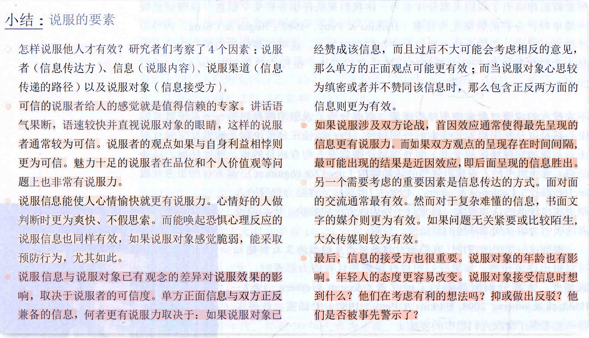

##### 偏见 p304

- 对一个群体及其成员的负面的预先判断
- 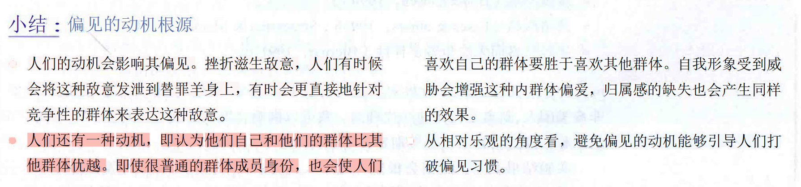
- 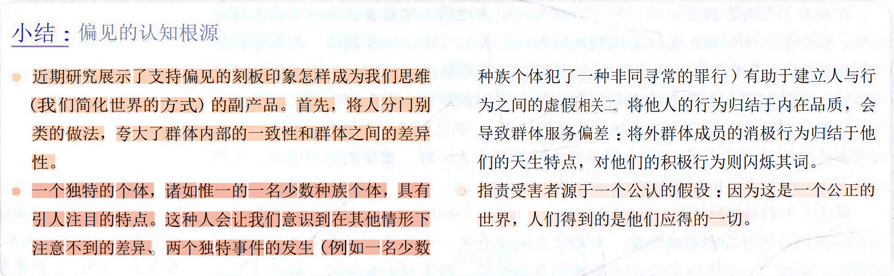

##### 说服的模型 

##### 睡眠者效应（the sleeper effect） 

- 因人们遗忘信息源或者遗忘其与信息的关系而导致的延迟性说服
- **谣言/虚假信息（来自不可靠来源）：**
  - 一个网上经常散布谣言的账号发布了一条未经证实的负面消息。理智的网友一看来源就直接判定不可信，不予采信。
  - 几个月后，这条消息本身的内容（某个“事实”或“指控”）可能在社交圈中被复述，但最初的来源完全被忽略。
  - 部分人可能开始相信这条消息的内容，因为它已经被“去源头化”了，不再有那个明显的不可靠标签。

##### 偏见的 ABCs(偏见是情感、行为倾向和信念的结合) 

- 我们以“针对某少数族裔群体X的偏见”为例：
  1. **认知(C)：刻板印象**
     - “群体X的人都很懒惰，不愿意努力工作。”
     - “群体X的人犯罪率更高，更危险。”
     - “群体X的人教育程度普遍较低，能力差。”
     - *这就是对群体X成员的概括性负面信念。*
  2. **情感 (A)：负面态度**
     - 对群体X的人普遍感到**厌恶**或**恐惧**。
     - 在公司里遇到群体X的同事或应聘者时，内心产生强烈的不适感或紧张感。
     - 在社区里看到群体X的家庭搬来，会感到**不安**或**不满**。
     - *这是基于那些负面信念（认知C）而产生的本能情绪反应。*
  3. **行为倾向 (B)：歧视倾向**
     - 作为一名**招聘经理**：当看到简历上的姓氏或照片推测求职者属于群体X时，尽管简历合格，**倾向**于直接筛掉或不优先考虑（心里想：“这种人不靠谱”）。 *[注意：这是行为倾向，如果真这么做了，就是歧视行为]*
     - 作为一名**商店老板**：对走进店里的群体X的顾客，**倾向**于更警惕、更关注（心里预设他们可能偷东西），甚至**倾向**于提供更差的服务。
     - 作为一名**房东**：接到群体X的潜在租客咨询时，**倾向**于谎称房子已租出去，或者要求更高押金。
     - 作为一名**普通市民**：在公共汽车上，如果旁边座位空着，有群体X成员走过来坐下时，**倾向**于把包放在旁边座位上或起身换位置。在小区业主群里，**倾向**于传播关于群体X邻居的负面八卦。
     - *这些行为倾向都是在特定情境下，由持有的负面信念（C）和情感（A）所驱动的行为意向。它们可能导致歧视，甚至在某些法律体系下构成歧视。但B本身描述的是倾向性，即“可能会怎么做”。*

##### 刻板印象威胁（stereotype threat）p341

- 当一个人属于某个在特定领域被负面刻板印象化的群体时，他/她会在与这个领域相关的任务或情境中感到额外的压力或焦虑，担心自己的表现可能会印证那个负面刻板印象。这种担心本身会消耗认知资源，干扰表现，从而可能真的导致他们在该任务中的实际表现低于其真实能力水平。
- 机制:
  - 压力
  - 自我监控，担心犯错
  - 抑制不必要的思维或情绪：调整思维会消耗一个人的认知资源

## **LECTURE_9_Atraction & Relationship** 

##### 影响人际吸引的因素 p390

接近性，熟悉性（曝光效应），相似性（匹配效应）和一些个人特征（外表吸引力） p390

- **曝光效应**：个体倾向于对自己**反复接触、熟悉的事物产生偏好或好感**的现象:
  - **植入广告：** 电影电视剧中反复出现某个特定品牌的手机、汽车或饮料，观众在不知不觉中对该品牌产生更积极的感觉。
- **匹配效应**：
  - 人们倾向于**寻找并最终与那些在整体吸引力水平（包括外表、社会地位、价值观念、兴趣等多方面）上与自己大致相当的人建立亲密关系**（如朋友、恋人、配偶）的现象
  - 拥有相似教育背景、职业声望、收入水平或家庭出身的人更容易走到一起。这体现了社会资本和经济资源价值的匹配。
- 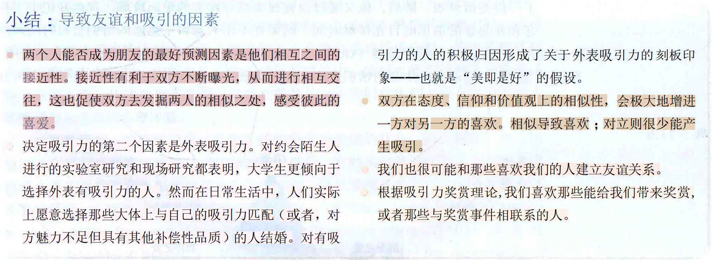

##### 爱情三角论/斯腾伯格爱情三成分理论 

- 亲密：指爱情关系中那些能**带来温暖体验**的情感。它代表着情感上的亲近感、联结感和分享的欲望。
- 激情：指驱动爱情关系的**驱动力和吸引力**，主要体现为生理的唤醒和渴望。它以**身体的吸引、性的结合**为主导，但也包括强烈的情感驱力，如浪漫、征服欲、自我表现等。
- 承诺： 指**有意识地决定去爱一个人，并决心长期维护这份爱情**。它包括**短期的决定**（决定爱一个人）和**长期的承诺**（致力于维持这份关系，即使面临困难）。

- 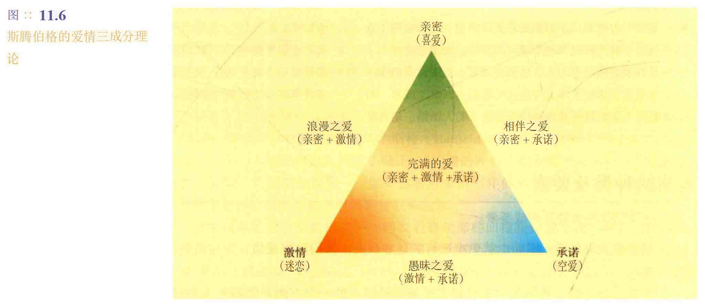

##### 什么是人际关系 

- 人际关系（Interpersonal Relationships）指**个体之间通过持续的社会互动所形成的情感联结、心理关联和行为模式**。它包含了人们认知、情感和行为上的相互影响与联结，满足个体的社会需求。简单说，就是**人与人之间建立起来并维系着的各种联系与互动模式**。

  **关键特征：**

  - **相互性：** 至少涉及两个个体（双向而非单向）
  - **互动性：** 通过语言、非语言信号、行为进行交流
  - **情感性：** 包含各种情感成分（喜欢、爱、尊重、厌恶等）
  - **目的性：** 为满足特定需求而生（归属、安全、认同等）
  - **动态性：** 随时间发展变化（深化、淡化、破裂或重建）

  **主要类型：**

  - **初级关系：** 亲密、持久、情感深厚（家人、挚友、伴侣）
  - **次级关系：** 目标导向、工具性（同事、客户、师生）
  - **正式关系：** 受社会角色规范约束（上下级、医患）
  - **非正式关系：** 自发形成，规则灵活（朋友、邻居）

##### 人际关系产生的原因 

- 人际关系并非偶然产生，而是源于人类深层的生物心理需求与社会性本质：

  1. 生存与安全本能（进化根源）

  - 早期人类必须协作才能抵御威胁、获取资源，群居提高存活率
  - 依恋理论：婴儿先天需要与照料者建立纽带获得保护 → 延伸至成人寻求伴侣/社群支持

  2. 归属与爱的需求（马斯洛需求理论）

  - 人天生渴望被接纳、被爱、成为群体一员
  - 孤独感会激活大脑的痛觉区域，归属感是基础心理需求

  3. 自我认同与确认

  - 通过他人反馈（镜像自我）确立"我是谁"
  - 社会比较：借他人评价校准自我认知与价值

  4. 信息获取与知识交换

  - 分享经验、减少不确定性（如新入职者向同事请教）
  - 社会网络是重要信息来源

  5. 工具性目标达成

  - 协作完成单人无法实现的任务（工作团队、兴趣社团）
  - 资源置换：通过关系网交换物质/机会（商业合作）

  6. 情绪支持与压力缓冲

  - 倾诉烦恼获得安慰，快乐共享倍增喜悦
  - 实证研究：社交支持强的人群抗压能力显著更高

##### 人际关系的建立和发展的阶段 

- 人际关系发展是一个**渐进过程**，心理学家乔治·莱文杰提出经典的**三阶段模型**（接触 → 深化 → 稳定/衰退），结合其他理论可细分为五个关键阶段：

  阶段1：觉察与单向注意

  - **特征：** 初步注意到对方存在（外表、声誉等）
  - **行为：** 无直接互动，仅观察评估
  - **案例：** 教室中注意到新同学，尚未交谈

  阶段2：表面接触与互惠试探

  - **特征：** 开始浅层互动，遵守社交礼仪
  - 行为：
    - 交换基本信息（姓名、职业）
    - 寻找共同话题（天气、兴趣）
    - 遵循互惠规范（互相微笑、简单帮助）
  - **风险点：** 90%关系停留于此阶段（如普通邻居）
  - **案例：** 同事间午餐闲聊健身话题

  阶段3：情感深化与自我暴露

  - **特征：** 信任建立，分享私人想法/感受

  - 行为：

    - 话题深入（价值观、童年经历）
    - 互惠式自我表露（你讲心事→我回应秘密）
    - 非正式互动增多（周末邀约）

  - 关键理论：

     社会渗透理论（Social Penetration）

    - 人际关系像剥洋葱：从外围信息（兴趣爱好）向核心层（脆弱情感）深入
    - 广度（话题范围）与深度（私密程度）共同决定亲密度

  - **案例：** 闺蜜深夜倾诉感情困扰

  阶段4：关系稳定与承诺

  - **特征：** 形成稳定联结，出现角色承诺
  - 行为：
    - 高度默契（非语言交流增多）
    - 共同维护关系（化解矛盾的策略）
    - 建立关系契约（默认的责任义务）
  - 重要指标：
    - 投资模型：双方投入大量资源（时间、情感），退出成本高
    - 认知依赖：重要决定考虑对方需求
  - **案例：** 已婚夫妻协调育儿分工

  阶段5：分化或衰退

  - 分化路径：
    - **正向深化：** 发展为长期承诺关系（挚友、婚姻）
    - 负向衰退：
      - 冲突积累 → 关系疏远（回避见面）
      - 沟通断绝 → 关系终结（离婚、断交）
  - 衰退过程（莱文杰模型）：
    1. **情感降温：** 分享欲减少，回避私人话题
    2. **边界收缩：** 恢复礼貌距离，减少共同活动
    3. **关系结束：** 明确终止或自然淡出

##### 促进亲密关系的因素

依恋 ：

- 个体与他人之间形成的一种强烈、持久的情感纽带和联结

- 安全型依恋
- 回避型依恋：这种类型的成人很少投 人亲密关系，而且更倾向于摆脱这种关系。回避型婴儿却在与母亲分别时很少表现出不安. 在与母亲团聚时也很少表现出对母亲的依附   
- 不安全依恋：焦虑和矛盾为标志。在陌生情境中，焦虑-矛盾型依恋的婴儿更容易紧紧地缠着母亲. 一旦母亲离开，他们就会大哭；可当母亲回来时，他们又表现出疏离或者敌意 

公平（社会交换理论、公平理论） 

- 社会交换理论：

  - **人性假设：** 人被假定为是**理性的决策者**，在关系中追求**个人利益最大化**或**损失最小化**。
  - **关系作为交换市场：** 关系被视为一个隐形的“市场”，个体在其中进行社会资源（不仅仅是金钱，还包括时间、精力、情感支持、陪伴、地位、信息、服务等等）的交换。
  - **比较水平：** 个体对关系的满意度取决于其 **“比较水平”**：指个体认为自己应得或理应获得的收益-成本比率。这个水平基于过往经历、社会规范、个人期望等。
  - **替代比较水平：** 个体还会评估 **“替代比较水平”**：指如果离开当前关系，自己能获得的最佳其他替代选择的质量。当前关系满意度不仅取决于自身收益成本比，还取决于是否存在更有吸引力的替代选择。
  - 回报与成本：

  - **回报：** 从关系中获得的积极结果（满足感、快乐、支持、物质资源、声望等）。
  - **成本：** 在关系中承担或经历的负面结果（时间投入、金钱投入、精力消耗、压力、冲突、失去的机会等）。
  - **结果：** 关系中的净收益 = 回报 - 成本。

  - **关系决策：**

  - **关系建立：** 个体倾向与那些预期能带来更多净收益（回报大于成本）的人建立关系。

  - **关系维持：** 如果当前关系提供的净收益高于或达到其比较水平（CL），并且高于或等于其替代比较水平（CL-alt），个体倾向于维持关系。

  - **关系改善/破裂：** 如果关系净收益低于比较水平（感到不满意），个体可能会尝试改变关系（如要求更多回报或减少投入）来增加净收益。如果经过努力仍然不满意，或存在更具吸引力的替代选择（CL-alt很高），个体就倾向于结束关系。

  - **互惠规范 (Norm of Reciprocity)：** 该理论强调了社会交换中一个关键的社会规范：当一方给予另一方某种资源（好处）时，受惠方有在未来某个时候回馈类似价值的资源的义务或期望。**破坏互惠（如过度索取或长期只付出无回报）被视为不公平。**

- 公平理论：人们不仅关心自己绝对的投入（Inputs）和产出（Outcomes），更关心自己的投入产出比与某个参照对象（通常是关系中的另一方，有时也可能是他人）的投入产出比是否相等。

自我表露（self-disclosure） 

- 信任替代焦虑，更容易展现自己，而不用担心失去他人的友情或爱情
- 表露互惠：一个人的自我表露会引发对方的自我表露

## **LECTURE_10&11_Soical Influnce** 

##### 从众定义 p187

- 根据他人而做出的自己行为的改变
- 表现形式：
  - **顺从**迫于外界压力而与群体趋同但内心并不赞同；服从是对直接命令的顺从
  - **接纳**是内心认可社会压力并在行动上保持一致

##### 从众的机制（规范性影响、信息性影响） 

- 规范性影响：想获得群体的接纳和免遭拒绝（想获得别人喜欢）
- 信息性影响：获得重要信息（想正确行事）
- 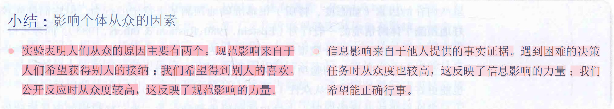

##### 影响从众的因素 

- **群体的规模**：规模较小的群体可以引起较大的效应；多个小群体的意见也使某个观点更为可信
  - 观看由4个助手做出判断的视频，当助手以两个两人团单独出现时，参与者的从众人数比助手以一个四人组出现时要多
- **一致性**：如果有人破坏了群体的一致性，那么会降低群体的影响力。
  - 美国加州大学心理学教授内梅斯和奇利斯发现他人持有异议——即使这种异议是错误的——会增强个体的独立性 (Nemeth & Chiles, 1988 )。 他们让大学生观察四人小组中的一个人错误地把蓝色判断为绿色, 尽管持异议者是错误的，但却能鼓励观察者表现自己的独立性——在 76% 的次数里，他们正确地把红色幻灯片判断为“红，即使其他所有人都说是“橙”色。而在缺乏有勇气的榜样人物鼓励的条件下,从众的次数达到了70%.
- **凝聚力：**凝聚力越强，对成员的影响越大。（黑人，白人）
- **地位：**地位高的人往往有更大的影响力。
  - 米尔格拉姆 ( Milgram, 1974 ) 报告说, 服从实验中地位低的人比地位高的人更愿意服从研究者的命令。在实施了 450 伏电击以后，一位 37 岁焊工转向研究者，恭敬地问 ：“教授，接下来怎么做？”(p.46) 另一个参与者是位神学院的教授，在 150伏时就开始不服从了，说：“我不明白为什么这个实验要建立在一个人的生命之上”，并且不断地质问研究者关于“这件事的道德”( p.48 ) 问题。  
- **公开的反应：**人们在公开场合更容易从众，匿名投票
- **事前承诺**：对某一行为和信念作出事先承诺，人们更可能坚持承诺,而不从众。
- 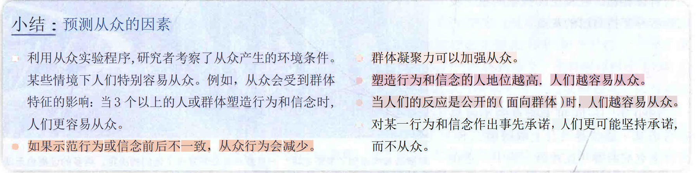

##### 顺从定义 

- **顺从**迫于外界压力而与群体趋同但内心并不赞同

##### 服从定义 

- 服从是对直接命令的顺从

##### 引起服从的因素 

- 与受害者的情感距离，我们常常漠视那些于己无关或失去个性的人，当参与者看见学习者的痛苦时，服从的比例下降
- 权力的接近性和正当性
- 机构的权威性

##### Sherif 的似动效应研究 

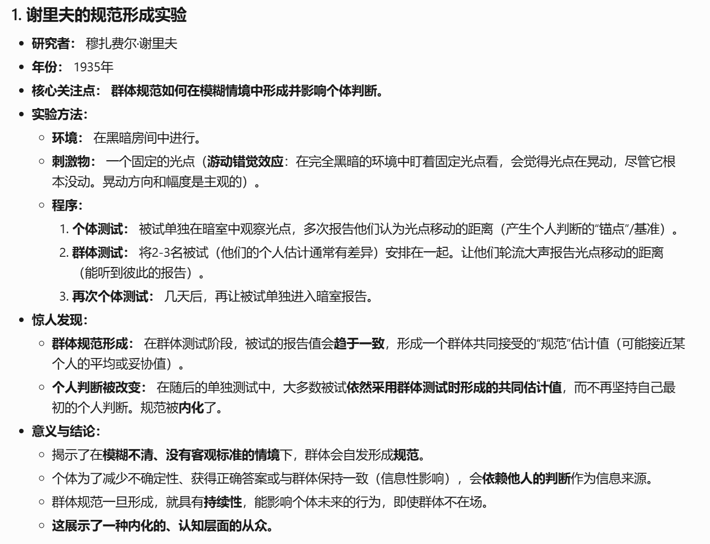

##### Asch 的线段长度判断研究 

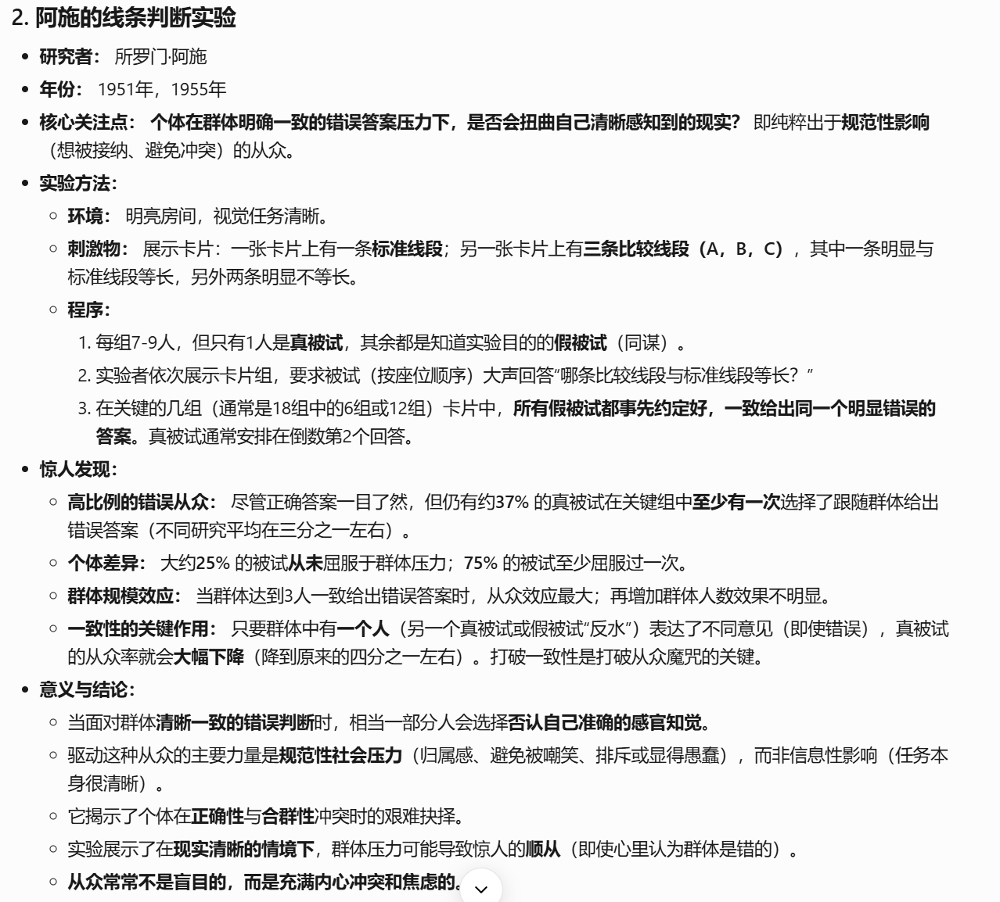

##### Milgram 电击实验 

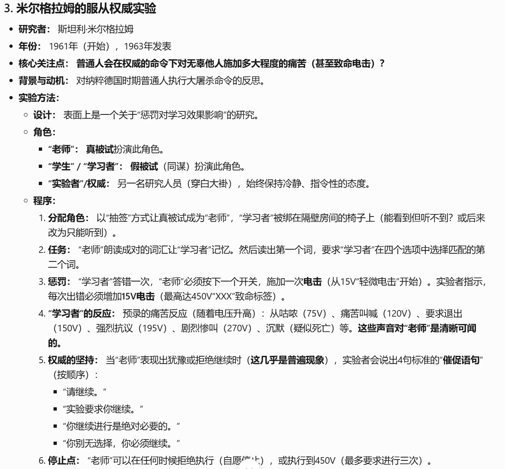

## **LECTURE_12_Positive psychology** 

##### 习得性无助 

##### 自我决定理论 

- 人有三种基本的、与生俱来的心理需求：自主性 (Autonomy)、胜任感 (Competence) 和归属感 (Relatedness)。当这些基本心理需求得到满足时，个体能产生高质量的内在动机和行为，促进身心健康发展、提升幸福感和绩效。
- 核心概念：
  - **自主性：** 感觉自己的行为是自我选择的、由自己发起和调节的。即“我想做”。
  - **胜任感：** 感觉自己有能力去完成某项任务、应对挑战。即“我能做”。
  - **归属感：** 感觉与他人有联结、被关心和重视。即“我爱并被爱”。
- 一个学生因为真心喜欢编程（自主性）、觉得自己能解决编程问题（胜任感）、并享受和同学们一起讨论项目（归属感）而努力学习编程（内在动机），而不是仅仅为了考试分数（外在动机）。

##### 习得乐观与乐观归因风格 

- 个体可以通过学习和练习，改变对事件解释的方式（归因风格），从而培养出一种乐观的人生态度和行为模式。**乐观归因风格**是习得乐观的核心认知技能。
- 项目失败了，乐观归因者可能想：“这次准备不够充分（暂时性、特定性），以后我需要更早开始（个人化改进可控部分）。” 而不是想：“我永远都做不好项目（永久性、普遍性），我太无能了（过度个人化，内在否定）。”

##### 幸福的基准点理论 

- 该理论认为，每个人的快乐或幸福水平有一个相对稳定的“基准点”，这个基准点主要由遗传和人格特质决定。当生活中发生重大正面（如中大奖）或负面（如遭遇重大疾病、残疾）事件时，幸福感会暂时上升或下降，但人们会逐渐**适应**新的环境，幸福感最终会**回归**到其个体特质的基准水平。

##### 幸福感与财富的关系 

- 核心发现：
  - **不是简单的正比关系：** 幸福感不会随着财富的无限增加而无限上升。
  - **满足基本需求很重要：** 当收入低于某个门槛（能保障基本生活、安全、健康需求）时，财富/收入的增加对幸福感的提升**非常大**。贫穷确实严重损害幸福感。
  - **超过门槛后效应递减：** 当收入超过满足基本需求的“富裕线”后（研究显示在达到国家平均水平左右后，或在全球约年收入7-9万美金/购买力平价之后），继续增加财富对提升**整体生活满意度**的效果**迅速减弱**甚至变得**不明显**。即达到“舒适”（而非奢华）水平后，钱对长期幸福感的影响很小。
  - **相对收入比绝对收入更重要：** 人们倾向于与他人（邻居、同事、同辈）的收入做比较。“攀比”带来的相对剥夺感会削弱财富带来的满足感。
  - **如何使用金钱比拥有多少更重要：** 研究表明，将金钱花在购买体验、促进社会联结、帮助他人或购买时间解放自己（如家务外包）上，比花在购买物质产品上更能带来持续的幸福感。
- **结论：** 追求财富本身并不是获得持久幸福的关键路径。在解决了基本温饱和安全之后，金钱对幸福的影响有限。**财富对幸福的价值主要体现在消除贫困带来的痛苦上，而不是带来持久的快乐。** 幸福感更多来自非物质的源泉。

##### 幸福的五元素理论（PERMA）

- **定义：** 由积极心理学创始人马丁·塞利格曼提出的理论框架，旨在描述人类繁荣（flourishing）和持久幸福（well-being）的五个核心构成元素。
- 五个元素：

  1. **P - 积极的情绪 (Positive Emotion):** 体验快乐、愉悦、满足、希望、爱、感恩、平静等积极情感。这是幸福的基石，但非唯一。
  2. **E - 投入/心流 (Engagement / Flow):** 完全沉浸和专注于某项活动，时间感消失，自我意识减弱。需要运用和发挥个人优势，挑战与技能匹配。
  3. **R - 人际关系 (Relationships):** 拥有积极、深刻、有意义的社会联结，感受到爱、支持、归属感和关怀。被广泛认为是幸福感最强的预测因子之一。
  4. **M - 意义与目的 (Meaning & Purpose):** 感觉自己的生活属于和致力于比自己更宏大、更持久的事物（如信仰、家庭、社会责任、理想）。理解自己生命的意义和价值。
  5. **A - 成就 (Accomplishment / Achievement):** 设定并努力实现具有个人意义的目标，追求成功、掌控感和精通。即使目标本身可能并不带来快乐或意义，追求的过程和达到的成就也能带来满足感。
- 核心观点：

  - 幸福感是一个多维度的结构，不仅仅是感觉快乐。
  - 这五个元素各自对幸福感有独立贡献，且可以测量。
  - 人们可以通过有意识地在这五个方面投资和发展来提高整体的幸福感和生活满意度（Flourishing）。
  - 强调追求PERMA元素是因为它们本身值得追求（即内在价值），而不是仅仅作为达到其他目的（如金钱）的手段。
- **应用：** 广泛应用于个人发展、教育、职场、临床心理学等领域，作为理解和提升幸福感的有效工具。

 